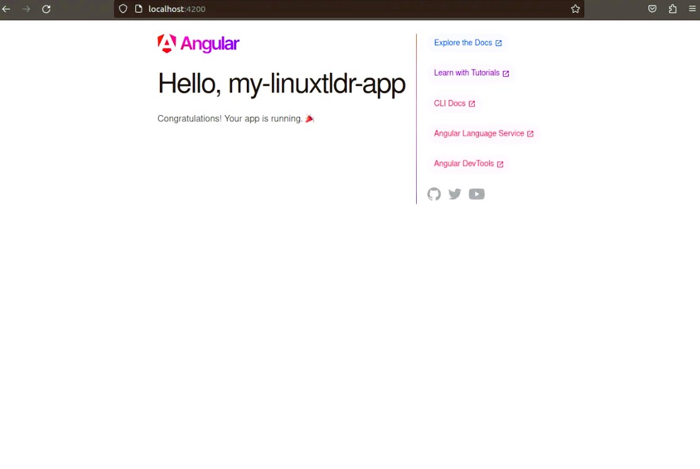
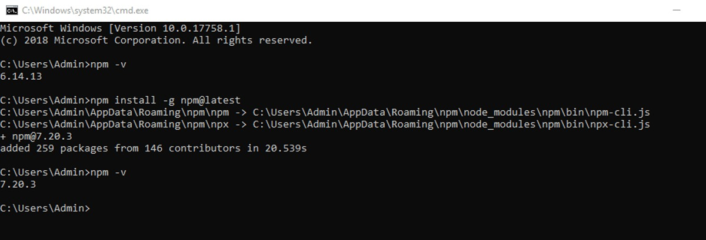
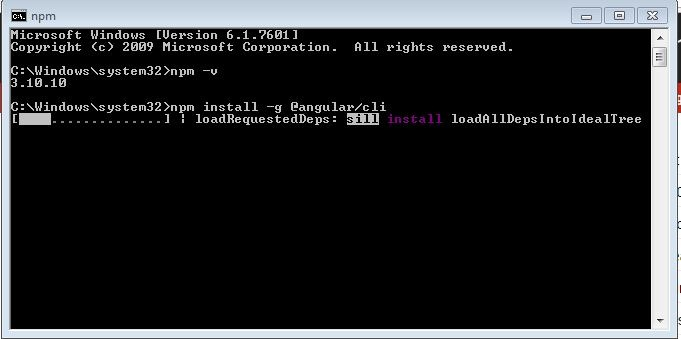

# Práctica Servidor Web

## 1. Titulo
**Creación y configuración de un proyecto Angular en Linux utilizando Angular CLI**

## 2. Tiempo de duración
**60 minutos** (Este tiempo puede variar dependiendo de la familiaridad con las herramientas y la configuración del entorno).

## 3. Fundamentos:

En esta práctica, aprenderé a crear un proyecto Angular desde cero en un sistema Linux usando la terminal. Angular es un framework desarrollado por Google para crear aplicaciones web de una sola página (SPA). Se basa en TypeScript y ofrece una estructura modular que hace que las aplicaciones sean escalables y fáciles de mantener.

Para facilitar el desarrollo, utilizaré **Angular CLI** (Command Line Interface), que es una herramienta de línea de comandos que me ayudará a crear y gestionar proyectos Angular, automatizando tareas como la creación de componentes, servicios y la configuración del entorno de desarrollo.

Además, necesitaré instalar **Node.js** y **npm**. Node.js es un entorno de ejecución para JavaScript en el servidor, y npm es el gestor de paquetes que se usa para instalar las dependencias del proyecto. Al instalar Angular CLI con npm, puedo crear y gestionar fácilmente mis proyectos Angular desde la terminal.

El proyecto Angular que crearé tendrá una estructura básica con directorios como `src/`, donde estará el código fuente, y `node_modules/`, que contendrá las dependencias de terceros necesarias para el proyecto. Angular usa **TypeScript** para escribir el código, lo que me proporciona tipado estático y facilita la detección temprana de errores.

### Imagen relacionada con la teoría:
  
*Figura 1-1. Estructura básica de un proyecto Angular.*

## 4. Conocimientos previos.

Para realizar esta práctica, necesito tener claros los siguientes temas:

- Comandos básicos en Linux.
- Instalación y manejo de Node.js y npm.
- Familiaridad con los navegadores web.
- Conocimiento básico sobre frameworks de JavaScript (aunque no es obligatorio).

## 5. Objetivos a alcanzar

- Crear un proyecto Angular desde cero utilizando Angular CLI.
- Configurar y ejecutar un servidor de desarrollo para probar la aplicación.
- Comprender la estructura básica de un proyecto Angular.
- Familiarizarme con el uso de comandos en la terminal para interactuar con Angular y Node.js.

## 6. Equipo necesario:

- Un computador con sistema operativo **Linux** (también se puede realizar en Windows o Mac).
- Acceso a una terminal de comandos.
- Tener **Node.js** v14 o superior instalado.
- Tener **Angular CLI** v12 o superior.
- Conexión a Internet para descargar las dependencias necesarias.

## 7. Material de apoyo.

- Documentación oficial de **Angular CLI**: [https://angular.io/cli](https://angular.io/cli)
- Cheat Sheet de **Linux**: [https://github.com/cheat/cheat](https://github.com/cheat/cheat)
- Documentación oficial de **Node.js**: [https://nodejs.org/en/docs/](https://nodejs.org/en/docs/)

## 8. Procedimiento

A continuación, te explico los pasos que seguiré para crear y ejecutar un proyecto Angular en mi sistema Linux:

**Paso 1: Instalar Node.js y npm en Linux**  
Lo primero que debo hacer es instalar Node.js y npm en mi sistema. Para ello, abro la terminal y ejecuto los siguientes comandos:

```bash
sudo apt update
sudo apt install nodejs
sudo apt install npm
```
  
**Paso 2: Instalar Angular CLI globalmente**  
Después de instalar Node.js y npm, usaré npm para instalar Angular CLI globalmente en mi sistema:

```bash
sudo npm install -g @angular/cli
```
  
**Paso 3: Crear un nuevo proyecto Angular**  
Ahora, usaré el siguiente comando para crear un nuevo proyecto Angular. Se me preguntará si quiero configurar rutas y qué tipo de estilos quiero usar (CSS, SCSS, etc.).

```bash
ng new nombre-del-proyecto
```
  
**Paso 4: Navegar al directorio del proyecto**  
Una vez que el proyecto se haya creado, entraré al directorio del proyecto con el siguiente comando:

```bash
cd nombre-del-proyecto
```
**Paso 5: Instalar dependencias (si no se instalaron automáticamente)**  
En caso de que las dependencias no se hayan instalado automáticamente, debo ejecutar el siguiente comando para instalar todas las dependencias necesarias:

```bash
npm install
```
**Paso 6: Ejecutar el servidor de desarrollo**  
Una vez que las dependencias estén instaladas, ejecutaré el servidor de desarrollo para que mi aplicación Angular sea accesible desde el navegador. Para ello, utilizo el siguiente comando:

```bash
ng serve
```
## 9. Resultados esperados

**Paso 7: Acceder a la aplicación en el navegador**  
Finalmente, abriré el navegador y escribiré la siguiente URL para ver mi aplicación en funcionamiento:

```bash
http://localhost:4200
```
  


## 10. Bibliografía
Angular CLI Documentation. (2021). Angular. Recuperado de: https://angular.io/cli

Node.js Documentation. (2021). Node.js. Recuperado de: https://nodejs.org/en/docs/


