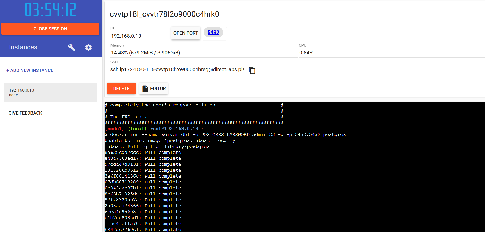
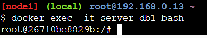
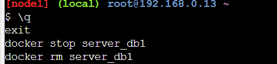

# Práctica: Creación de contenedores PostgreSQL en Docker y persistencia de datos

## 1. Título
**Creación de contenedores PostgreSQL con persistencia de datos utilizando Docker**

## 2. Tiempo de duración
**60 minutos** .

## 3. Fundamentos

En esta práctica, aprenderé a trabajar con contenedores Docker para manejar bases de datos PostgreSQL. Docker es una herramienta que permite crear, desplegar y ejecutar aplicaciones en contenedores, lo que facilita la portabilidad y la gestión de dependencias.

El objetivo es crear dos contenedores PostgreSQL: uno sin volumen (para comprobar cómo se pierden los datos al eliminar el contenedor) y otro con volumen (para persistir los datos a través de la eliminación y recreación del contenedor).

PostgreSQL es un sistema de gestión de bases de datos relacional muy popular que utilizaré para demostrar cómo manejar bases de datos en contenedores Docker. Al usar Docker para gestionar PostgreSQL, puedo crear entornos de bases de datos fácilmente, pero debo asegurarme de usar volúmenes para evitar la pérdida de datos al detener o eliminar contenedores.

### Imagen relacionada con la teoría:
  
*Figura 1-1. Volumenes.*

## 4. Conocimientos previos

Para realizar esta práctica, es importante tener conocimientos sobre los siguientes temas:

- Conceptos básicos de Docker y contenedores.
- Uso de la terminal de comandos.
- Familiaridad con PostgreSQL y su uso básico.
- Conceptos de volúmenes en Docker para persistencia de datos.

## 5. Objetivos a alcanzar

- Crear un contenedor PostgreSQL sin volumen y comprobar la pérdida de datos.
- Crear un contenedor PostgreSQL con volumen para persistencia de datos.
- Comprender cómo Docker maneja los volúmenes y la persistencia de bases de datos.
- Conectar a PostgreSQL desde un administrador de base de datos como DataGrip o TablePlus.

## 6. Equipo necesario

- Un computador con **Docker** instalado.
- **PostgreSQL** como base de datos.
- **DataGrip** o **TablePlus** para conectarse a la base de datos.
- Acceso a una terminal de comandos.

## 7. Material de apoyo

- Documentación oficial de **Docker**: [https://docs.docker.com/](https://docs.docker.com/)
- Documentación oficial de **PostgreSQL**: [https://www.postgresql.org/docs/](https://www.postgresql.org/docs/)

## 8. Procedimiento

A continuación, te explico los pasos que seguiré para crear y gestionar contenedores PostgreSQL con Docker:

### Parte 1: Base de datos sin volumen

**Paso 1: Crear un contenedor PostgreSQL sin volumen**  
Primero, crearé un contenedor PostgreSQL sin volumen, lo que significa que los datos se perderán al eliminar el contenedor. Ejecuto el siguiente comando:

```bash
docker run --name server_db1 -e POSTGRES_PASSWORD=admin -d postgres
```
  
**Paso 2: Conectarse al contenedor con un administrador de base de datos**  
Conecto a PostgreSQL utilizando un cliente como DataGrip o TablePlus, usando la siguiente configuración:

- Host: `localhost`
- Puerto: `5432`
- Usuario: `postgres`
- Contraseña: `admin`


  


**Paso 3: Crear una base de datos y tabla**  
Una vez conectado, creo una base de datos llamada `test` y una tabla `customer` con los siguientes campos:

```sql
CREATE DATABASE test;
\c test;
CREATE TABLE customer (
    id SERIAL PRIMARY KEY,
    fullname VARCHAR(100),
    status VARCHAR(20)
);
INSERT INTO customer (fullname, status) VALUES ('Juan Pérez', 'activo');
```
**Paso 4: Detener y eliminar el contenedor**  
Detengo y elimino el contenedor con los siguientes comandos:

```bash
docker stop server_db1
docker rm server_db1
```
 

**Paso 5: Volver a crear el contenedor**  
Vuelvo a crear el contenedor, pero los datos de la base de datos y la tabla deberían haber desaparecido.

```bash
docker run --name server_db1 -e POSTGRES_PASSWORD=admin -d postgres
```

**Paso 6: Verificar la pérdida de datos**  
Conecto nuevamente al contenedor desde DataGrip o TablePlus y verifico que la base de datos `test` y la tabla `customer` ya no existen.

### Parte 2: Base de datos con volumen

**Paso 1: Crear un volumen en Docker**  
Para crear un volumen que persista los datos, ejecuto el siguiente comando:

```bash
docker volume create pgdata
```


**Paso 2: Crear un contenedor PostgreSQL con volumen**  
Ahora, creo un nuevo contenedor PostgreSQL asociando el volumen `pgdata`:

```bash
docker run --name server_db2 -e POSTGRES_PASSWORD=admin -v pgdata:/var/lib/postgresql/data -d postgres
```

**Paso 3: Conectarse al contenedor y crear la base de datos**  
Me conecto nuevamente con DataGrip o TablePlus, y creo la base de datos `test` y la tabla `customer`:

```sql
CREATE DATABASE test;
\c test;
CREATE TABLE customer (
    id SERIAL PRIMARY KEY,
    fullname VARCHAR(100),
    status VARCHAR(20)
);
INSERT INTO customer (fullname, status) VALUES ('', 'activo');
```

**Paso 4: Detener y eliminar el contenedor**  
Detengo y elimino el contenedor `server_db2`:

```bash
docker stop server_db2
docker rm server_db2
```

**Paso 5: Volver a crear el contenedor con el volumen**  
Ahora, recreo el contenedor usando el volumen `pgdata`:

```bash
docker run --name server_db2 -e POSTGRES_PASSWORD=admin -v pgdata:/var/lib/postgresql/data -d postgres
```

**Paso 6: Verificar la persistencia de los datos**  
Me conecto de nuevo con DataGrip o TablePlus y verifico que la base de datos `test` y la tabla `customer` aún existen, y que el registro que inserté anteriormente sigue presente.

 

## 9. Resultados esperados

- En la **Parte 1**, después de eliminar el contenedor sin volumen, la base de datos y la tabla deberían haberse perdido, lo que demuestra que los datos no se persisten sin volúmenes.
- En la **Parte 2**, después de eliminar y recrear el contenedor con volumen, los datos deberían haberse conservado, demostrando que el volumen asegura la persistencia de la base de datos y sus registros.
---

## 10. Bibliografía

- Docker Documentation. (2021). Docker. Recuperado de: [https://docs.docker.com/](https://docs.docker.com/)
- PostgreSQL Documentation. (2021). PostgreSQL. Recuperado de: [https://www.postgresql.org/docs/](https://www.postgresql.org/docs/)

